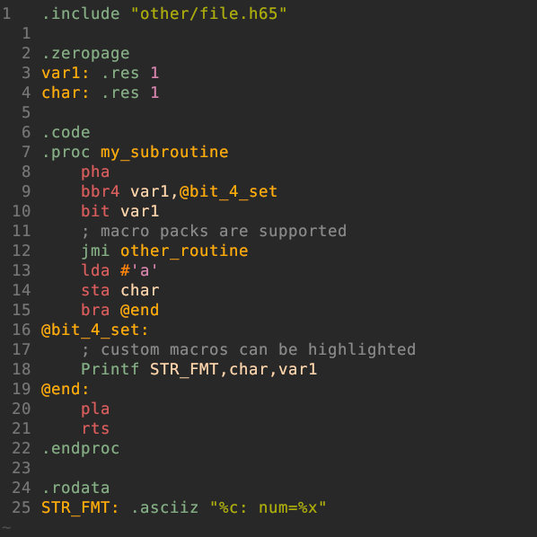

# vim-ca65: Vim support for the ca65 assembler
This plugin provides **syntax** highlighting, **convenience** functions and **help** pages for the ca65 assembler.

*I currently only work with the 65C02 processor. However, I tried to include everything for the 65816 as well. 
If you find anything that is missing or mistakes, please open an issue or a pull request.*

<p align="center">

</p>


## Features
### Syntax Highlighting
The syntax highlighting currently supports the (undocumented) 6502, 65C02 and 65816 opcodes, the ca65 assembler functions
and the macro packs `generic` and `longbranch`.

### Convenience
This plugin provides the `b:match_words` variable for jumping between words (requires `matchit.vim`)
Supported are the assembler commands like `.if` `.endif`, `.macro` `.endmacro` as well as stack instructions.
This allows easier checking of stack push/pull order.

There is also a function that opens a header/source file with the same name in a vsplit.
For example if `~/project/main.s65` is opened, the function would open `~/project/main.h65` to the right of it.

### Help
I compiled parts of the W65C02 datasheet and parts of the "Programming the 65816" book into a vim help page.
Type `:help <opcode>` (or `help ca65-<opcode>` if the first one gives the wrong page) to see information about an opcode (how it works, updated flags...).

## Installation
Install using your favorite plugin manager, for example with vim-plug:
```vim
" in vimrc
call plug#begin()
Plug 'matthiasquintern/vim-ca65'
call plug#end()
```


## Configuration
### Select processor
By default, the syntax highlighting only highlights the original 6502 instructions.
#### Globally in vimrc
To always enable the illegal/undocumented instructions, the 65C02 instructions or the 65816 instructions, include this in your `vimrc`:
```vim
" in ~/.vimrc
let g:ca65_illegal = 1  " enable the illegal 6502 opcodes
let g:ca65_65C02 = 1    " enable 65C02 instructions
let g:ca65_65816 = 1    " enable 65816 instructions
```

#### Per-file or project
Alternatively, you can enable processor syntax highlighting for a specific file by including a [modeline](https://vim.fandom.com/wiki/Modeline_magic) in the file:
```ca65
; in your ca65 file, include one of these lines at the top or bottom of the file:
; vim: ft=ca65.ca65-65C02
; vim: ft=ca65.ca65-65816
; vim: ft=ca65.ca65-illegal
```
Setting the filetype `ca65-...` will simply set the corresponding `g:ca65-...` variable.

### Select filetype
By default, the plugin loads for files having a `.s65` or `.h65` extension.
To load it for your preferred extension, write this into `~/.vim/ftdetect/ca65.vim`:
```vim
" in ~/.vim/ftdetect/ca65.vim
au BufRead,BufNewFile *.myExtension setfiletype ca65
```
### Customize syntax highlighting
If the labels and instructions have the same color in your colorscheme, 
link `ca65Label` (or `ca65Opcode`) to another class, eg: 
```vim
" in ~/.vim/ftplugin/ca65.vim
hi link ca65Label Typedef
```

You can add syntax highlighting for your own macros like this:
```vim
" in ~/.vim/ftplugin/ca65.vim
syn keyword ca65customMacros Macro1 Macro2 mul div macro3
```

### Header/Source split function
To use the source-header split function, map it and set your preferred assembly filetypes:
```vim
" in ~/.vim/ftplugin/ca65.vim
nnoremap <buffer> <leader>h :call SplitHeader("h65", "s65")<Cr>
```
